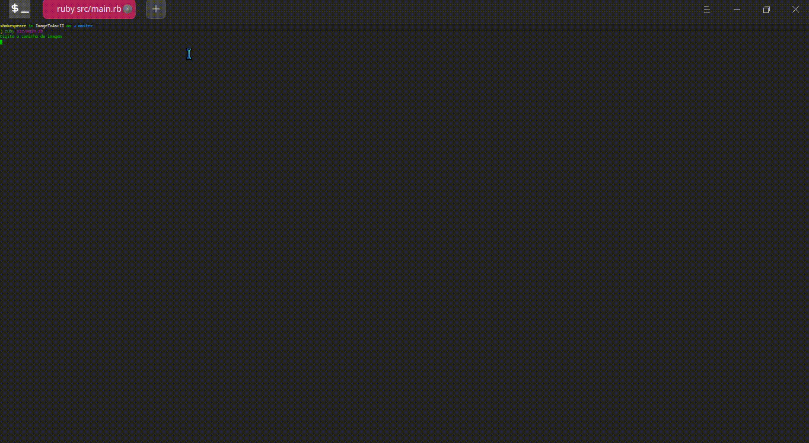

<h1 align="center">
    Image to ASCII
</h1>
<p align="center">
   <a>
    
  </a>

  
	
  <a href="www.linkedin.com/in/walyssonpaiva">
    
  </a>

  <a>
    
  </a>

 
  
</p>
<h1>
  :clipboard: Projeto:
</h1>



<h1>:book:O que eu aprendi:</h1>
<ul>
<li> Manipulação de imagens</li>
<li> Testes</li>
<li> Lidar com arrays de diferentes dimensões (3d-array)</li>
<li> <s>Desenhar</s></li>
</ul>

<h2>:information_source: Como usar: </h2>
<p> ps: você precisa ter o Ruby instalado </p>
Em seu terminal:

``` 
Clone this repository
$ git clone https://github.com/WalyssonPaiva/image-to-ascII.git

Go into the repository
$ cd image-to-ascII

Install dependencies
$ bundle install

Run
$ ruby src/main.rb

```
<p>Projeto inspirado e baseado: <a href="https://robertheaton.com/2018/06/12/programming-projects-for-advanced-beginners-ascii-art/">Neste artigo</a> 
e <a href="https://github.com/savio-matheus/ascii_inator">neste repositório</a> </p>
<p>Thanks for reading :heart:</p>
